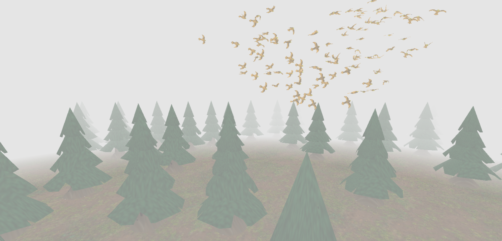
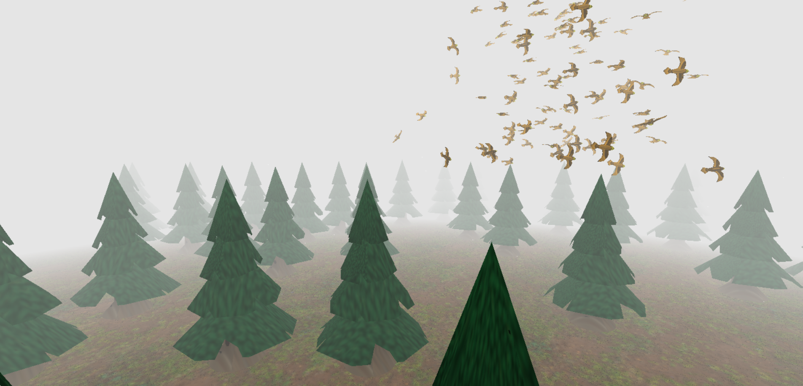
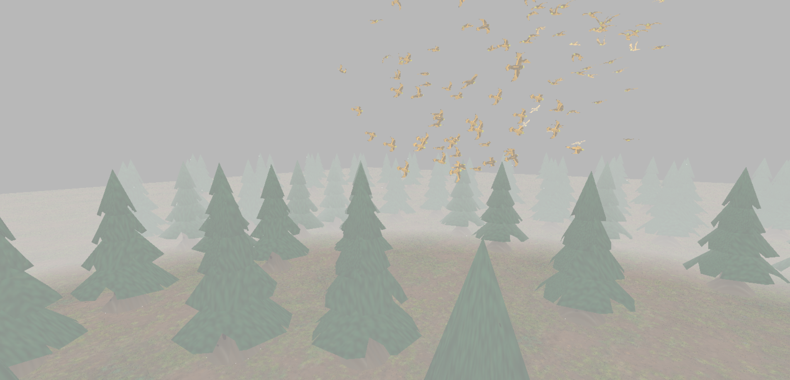
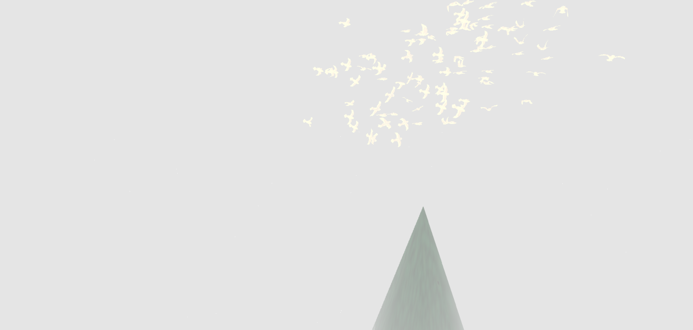
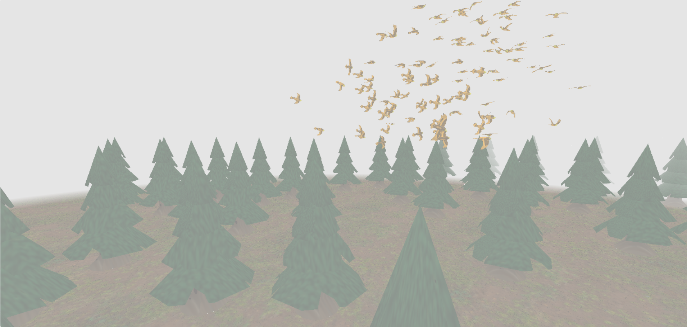
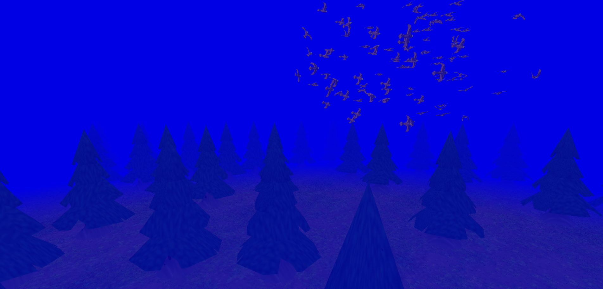
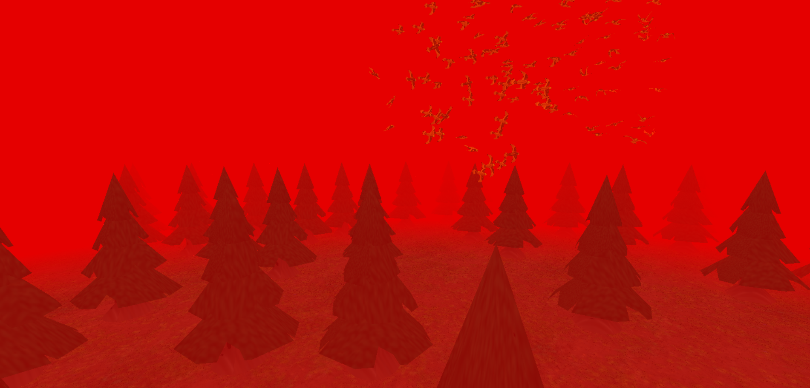
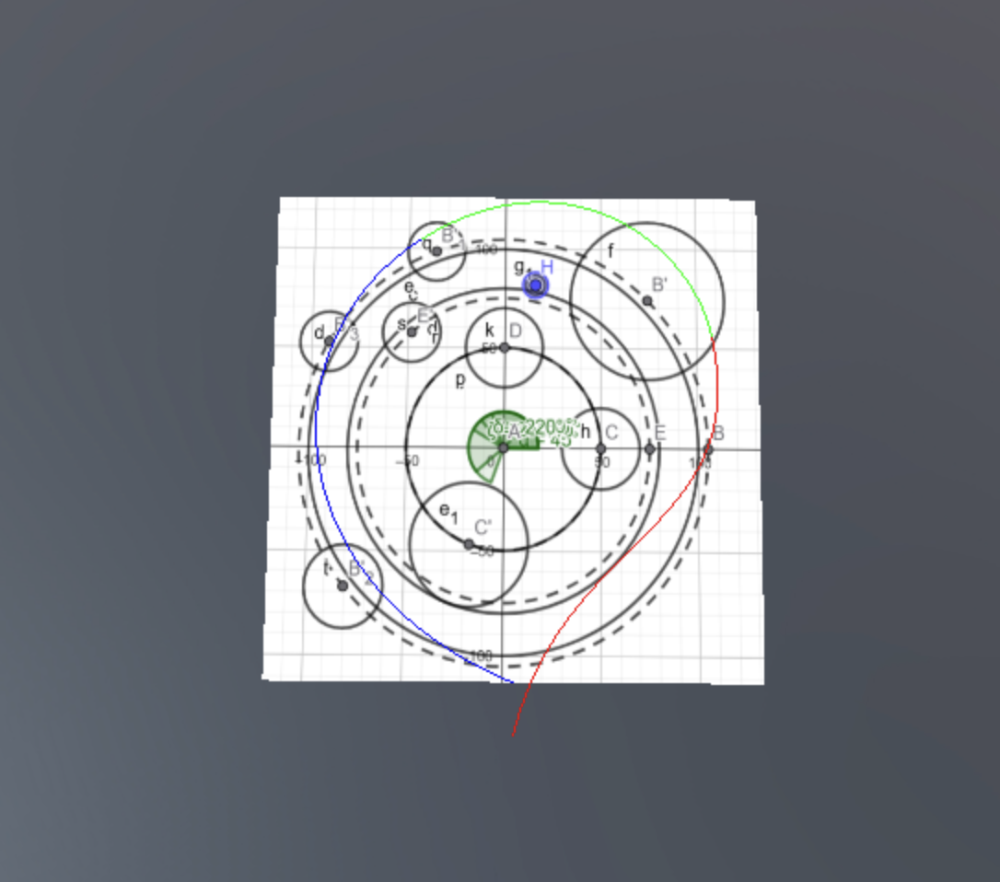
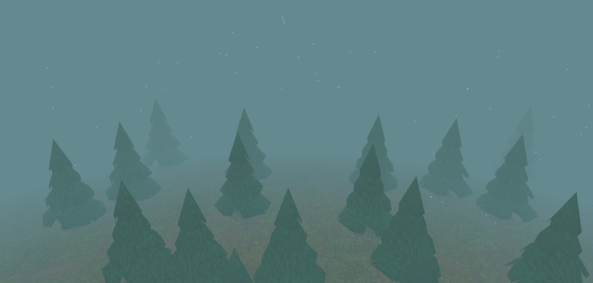

# In Flight

<figure style="text-align: center;">
  <video src="videos/ProjectTeaser.mp4" height="300px" autoplay loop muted></video>
  <figcaption>A short teaser video of the final result.</figcaption>
</figure>

## Abstract

The goal of our project, "In Flight," is to create a dynamic and visually engaging 3D scene showcasing bird animation and flocking behavior. We aimed to implement the boids algorithm to simulate the behavior of a flock of birds flying through a forest filled with pines swirling in between them and dodging them to create a movie-like scene which is the video referenced below in our Resources section.

## Overview

As described earlier in the abstract, our goal was to create a scene of birds flying through a forest in a realistic manner. To accomplish this, we implemented a boids algorithm to simulate the behavior of a flock of birds. We added the classic forces of a Boids-like algorithm (avoidance, cohesion, alignment and containment) while also adding some more features which will be further described in our feature validation of this effect. The second feature we decided to implement was to design our own custom meshes, namely the birds and the trees. We did so using Blender and tutorials on how to proceed in order to have a nicer result. The third feature we added was Normal Mapping to have more visually complex and realistic appearance for our low-polygon models. The fourth feature was the implementation of fog in our scene. This was important for the immersion of the scene as it hides the edges of the "map", while adding a cinematic and mysterious look to the scene. The fifth and final feature was Bezier curves that were used to create a smooth camera path to follow the birds in flight like in the movie clip that inspired us.

## Feature validation

<table>
	<caption>Feature Summary</caption>
	<thead>
		<tr>
			<th>Feature</th>
			<th>Adapted Points</th>
			<th>Status</th>
		</tr>
	</thead>
	<tbody>
		<tr>
			<td>Mesh and Scene Design</td>
			<td>5</td>
			<td style="background-color: #d4edda;">Completed</td>
		</tr>
		<tr>
			<td>Normal mapping</td>
			<td>10</td>
			<td style="background-color: #d4edda;">Completed</td>
		</tr>
		<tr>
			<td>Fog</td>
			<td>5</td>
			<td style="background-color: #d4edda;">Completed</td>
		</tr>
		<tr>
			<td>Boids</td>
			<td>20</td>
			<td style="background-color: #d4edda;">Completed</td>
		</tr>
		<tr>
			<td>Bezier curves</td>
			<td>10</td>
			<td style="background-color: #d4edda;">Completed</td>
		</tr>
	</tbody>
</table>

### Mesh Design

#### Implementation

We designed our meshes in Blender, mainly by following tutorials on YouTube ([Pine tree tutorial](https://www.youtube.com/watch?v=mgJxH_Jc2DI), [Tree tutorial](https://www.youtube.com/watch?v=hvxoAX_poI0), [Bird tutorial](https://www.youtube.com/watch?v=eSL98LLr1kw&list=WL&index=29)). These were very helpful as it was our first/second time working with Blender and helped us achieve a good visual result while managing the object complexity. We won't detail the steps taken for every mesh as the tutorials give a very solid explanation on how to proceed. We opted to not use other tree models/other meshes than our pines as when testing with more variations the resulting forest looked very weird and unnatural because the tree models don't blend well together.

#### Validation

<figure style="text-align: center;">
    
    <figcaption>Our pine design in Blender</figcaption>
</figure>

<figure style="text-align: center;">
    
    <figcaption>Our pine mesh rendered by the project framework</figcaption>
</figure>

<figure style="text-align: center;">
    
    <figcaption>Pine in the YouTube tutorial</figcaption>
</figure>

<figure style="text-align: center;">
    
    <figcaption>A second tree design in Blender</figcaption>
</figure>

<figure style="text-align: center;">
    
    <figcaption>Second tree design rendered by the project framework</figcaption>
</figure>

<figure style="text-align: center;">
    
    <figcaption>Tree design in the YouTube tutorial</figcaption>
</figure>

<figure style="text-align: center;">
    
    <figcaption>Our bird mesh in Blender</figcaption>
</figure>

<figure style="text-align: center;">
    
    <figcaption>Our bird design rendered by the project framework</figcaption>
</figure>

<figure style="text-align: center;">
    
    <figcaption>Bird design in the YouTube tutorial</figcaption>
</figure>

*Note: The above objects are not exhaustive of all the meshes we created. All the meshes can be found in our assets folder*

### Fog

#### Implementation

We implemented the fog in the blinn phong shader, as suggested by the tutorial provided in the project instructions. The fog is rendered by mixing the color of the fog with the color of each fragment without the fog. The intensity of the fog at a given fragment is given by the distance of this fragment from the camera.
First we need to input the fog color, a minimum and maximum distance values and a minimum and maximum intensity values to the pipeline. Every fragment closer to the camera than the minimum distance threshold will have the minimum intensity fog and every fragment further from the camera than the maximum distance threshold will have fog corresponding to the maximum intensity value. Between these two thresholds we used linear interpolation to calculate the fog intensity.
These calculations happen in the fragment shader after the color of the fragment without any fog has been computed. The distance of the fragment from the camera is the length of the vector representing the fragments position in view space, as in this space the camera is at the origin.
The weight to mix the the fog color with the fragment color is simply the intensity calculated.

#### Validation

{width="500px"}

The parameters for the fog in the final scene are : minimum intensity = 0.6, maximum intensity = 1, minimum distance threshold = 1, maximum distance threshold = 7.2, color = (0.9, 0.9, 0.9).

Below, you can see the effect of modifying each parameter individually. Note that when maximum intensity is below 1, we can see the edge of the ground plane, underlying the importance of the fog.

  <figure>
	
	<figcaption>Minimum intensity is 0</figcaption>
  </figure>

  <figure>
	
	<figcaption>Maximum intensity is 0.8</figcaption>
  </figure>

  <figure>
	
	<figcaption>Distance thresholds: min = 0.2, max = 1</figcaption>
  </figure>

  <figure>
	
	<figcaption>Distance thresholds: min = 6, max = 9</figcaption>
  </figure>

  <figure>
	
	<figcaption>Blue fog</figcaption>
  </figure>

  <figure>
	
	<figcaption>Red fog</figcaption>
  </figure>

### Normal Mapping

#### Implementation

We implemented the mapping based on the course material and the [example](https://lettier.github.io/3d-game-shaders-for-beginners/normal-mapping.html) provided in the instructions for the project. We implemented the normal mapping directly in the Blinn Phong shader renderer as it required only small adaptations. Moreover, a normal map is just a texture, so it made sense to obtain the normal mapping data of each fragment at the same time as its color.
To calculate the modified normal of each fragment, we need the normal map texture, the position of the fragment on this texture, the original normal of the fragment as well as its tangent and bitangent.
We created a new material called "NormalTexturedMaterial" which takes two parameters, a texture and a normal map. The UV mapping of the fragment coordinates is the same as for the texture, so no new code had to be added. The ".obj" files representing our meshes only store vertex normals, so in order to get tangents and bitangents we need to calculate them. This is done when loading the mesh from the file in `cg_mesh`. We then pass the vertex normal tangent and bitangent to the vertex shader where we interpolate all three before passing them to the fragment shader where the final computation is done following the formula seen in the lectures : `n = normalize(x * t + y * b + z * n);` where x,y and z are the three values obtained from the normal map.

#### Validation

As shown below we have 1 implementation where we turned off normal mapping (which gives a texture without any details, as it should), next to it we have our implementation of the texture where we added normal mapping and finally for reference we have the original sphere from PolyHeaven, where the texture and the normal map come from. As we can see the mapping adds details, contrast to the texture and helps soften the transition from light to shadow.

<figure style="text-align: center;">
    
    <figcaption>Texture without normal mapping</figcaption>
</figure>

<figure style="text-align: center;">
    
    <figcaption>Texture with normal mapping</figcaption>
</figure>

<figure style="text-align: center;">
    
    <figcaption>[Reference texture from PolyHeaven](https://polyhaven.com/a/brown_mud_leaves_01)</figcaption>
</figure>

Here is a demo of our implementation with a normal map taken from the [Internet](https://en.wikipedia.org/wiki/Normal_mapping) to showcase how normal mapping adds "fake" terrain on a flat white surface:
<figure style="text-align: center;">
	<video src="videos/Normal_map_video.mp4" height="350px" autoplay loop muted></video>
	<figcaption>Normal mapping demo</figcaption>
</figure>

### Boids

#### Implementation

Our Boids algorithm simulates the flocking behavior of birds by applying a set of rules to each individual boid (bird) in the simulation. Each boid has a current position and velocity. In each step of the simulation, a new velocity is calculated for every boid based on several influencing forces, and its position is then updated. These are the forces we used which are based on a previous lab done by us in a previous course (CS-214) :

- **The `avoidanceForce`** function checks for other boids within a defined `avoidanceRadius`. If a nearby boid is detected, a repulsive force is generated, pushing the current boid away from it. The strength of this repulsion is inversely proportional to the distance (stronger for closer boids) and is capped by `avoidanceForceLimit` to prevent excessively strong reactions.
  
- **The `cohesionForce`** function calculates the center of mass of neighboring boids within a `perceptionRadius`. It then generates a force vector pointing from the current boid's position towards this perceived center. The `diffFromMeanPerceptionFiltered` helper function is used to find this average position of neighbors.

- **The `alignmentForce`** function calculates the average velocity of neighboring boids within the `perceptionRadius`. It then generates a force that attempts to steer the current boid towards this average velocity. Again, `diffFromMeanPerceptionFiltered` is used, this time to average the velocities of neighbors.

- **The `containmentForce`** function keeps the boid in a certain boundary by applying a force to the boid if it is out of the predefined areas to bring it back. This function is quite complex in our implementation as we defined a boundary so that all birds follow a general corridor through the forest. We first define the boundaries in the x and y plane. After that we also created boundaries for the boid height by checking the z coordinate. Usually the force applied to a boid out of the predefined zone is normal to the boundary "wall". However, as we wanted the birds to move forward through the forest and not bounce between the "walls" we rotated the force applied (by a specified angle) to push the birds forward. Here is a more detailed explanation of the different elements of this function:
	- "Cylinder" Definitions: The cylinder helper function defines cylindrical zones, each with a center in the XY plane, a radius, and a preferred direction of movement (trigonometric or inverse) for boids interacting with it. We call these exclusion zones cylinders as all checks are done on the horizontal distance of the boid to the center "axis" of the exclusion zone.
	- Cylinder Interaction: The cylinderCheck function determines if a boid's XY position is within a cylinder. If so, it applies a force to steer the boid out of the cylinder and along the cylinder's edge in the specified direction.
	- Quadrant-Specific Logic: The containment logic is divided into quadrants based on the boid's angle around the Z-axis. Different sets of guiding cylinders are active in different quadrants, creating a complex, predefined flight path (shown in the challenges section).
	- Global Boundaries: There's a global outer radius to prevent boids from flying too far away and an inner radius to keep them from collapsing into the origin.
	- Z-Axis Containment: Simple upper and lower limits are enforced on the Z-axis, pushing boids back towards the median flight altitude if they stray too high or too low. 

**Putting everything together:** 
The forces calculated from Avoidance, Cohesion, Alignment, and Containment are each multiplied by their respective weights (`avoidanceWeight, cohesionWeight, alignmentWeight, containmentWeight`). These weights determine the relative influence of each behavior which is demonstrated below in the attached videos.
The weighted forces are summed up to get a net acceleration vector.
This acceleration is then added to the boid's current velocity (scaled by the timestep `dt`) to compute the new velocity. The boid's speed is always clamped between a lower and an upper bound. The upper bound can temporarily increase if the boid is lagging behind the average angular position of the flock, helping it catch up.

The forces weights and the evolveBoid function are defined in boids.js. The evolveBoid function is then called by each bird (defined as an actor in the scene) in evolve function.

#### Validation

<figure style="text-align: center;">
  <video src="videos/boidsDemo.mp4" height="300px" autoplay loop muted></video>
  <figcaption>Illustrative video of our boids' behavior</figcaption>
</figure>

The above video showcases how our boids behave when the area they can evolve in is a simple and symmetric shape. This is to clearly see their interactions without the added complexity of the trajectory. This scene can be found in the file named `boidsDemo_scene`.js. We created a copy of our boids.js file (`boidsDemo.js`) to be able to modify the containmentForce and the weights for the demos without affecting the final scene. We also increased the number of boids to 200 for this demonstration to clearly show the interaction of a big flock.

As we can see in the video the boids behave as expected. Below we show what happens when adjusting the weights of certain forces so that you can better observe their effects on the boids.

<figure style="text-align: center;">
  <video src="videos/boidsDemoS.mp4" height="300px" autoplay loop muted></video>
  <figcaption>Max speed increased as well as avoidance weight</figcaption>
</figure>

In this second video we increased the max speed our boids could have by 1/3 and also multiplied the avoidance by 6 to better showcase how the forces work. As we can see, the boids' behavior seems more erratic, this is simply due to the fact that the outputted force when two birds get too close to each other is much bigger which is why some boids change directions very quickly. The speed increase is also noticeable as the boids seem to fly around much faster.

<figure style="text-align: center;">
  <video src="videos/boidsDemoC.mp4" height="300px" autoplay loop muted></video>
  <figcaption>Alignment and cohesion weight both doubled</figcaption>
</figure>

In this third video we doubled both the alignment and cohesion weights again to better showcase their effects. As can be seen, the birds now seem to split into two groups (which is the way we make them spawn) and, contrary to the other two videos, they stay packed quite close together in these two groups throughout the video which is simply due to the fact that the forces attracting them together is much stronger and thus overshadow the other forces affecting the boids.

These three videos showcase the effects of all forces well and how they work all together to create a cohesive result. We decided not to include videos for other parameter configurations to keep this section somewhat concise as there are too many options.

### Bézier Curves

#### Implementation

To create a smooth and predefined camera path for our scene, we implemented a system based on Bézier curves. To implement this we mainly used the reference given in the handout for [bezier curves](https://www.shadertoy.com/view/XtBGDR). Our approach, primarily managed within `bezier.js`, involves defining the camera's trajectory using three distinct cubic Bézier curve segments. Each segment corresponds to a specific time interval in our animation (0-9.72s, 9.72-17.22s, and 17.22-30s), allowing for varied camera movements over time.

For each segment, the camera's 3D position is determined by evaluating the corresponding Bézier curve at the current animation time. To ensure the camera orients itself correctly along the path, we also calculate the curve's tangent (its first derivative) at that point. This tangent vector provides the direction the camera should be looking. We focused on ensuring smooth transitions between these segments to avoid abrupt camera movements.

A specialized `BezierCamera` class was developed to handle this logic. Each frame, this camera updates its position and orientation based on the active Bézier curve segment and the current time. It then computes the necessary view matrix, which is used to render the scene from the camera's smoothly moving perspective. This method allowed us to achieve the desired cinematic camera flight through the environment.

#### Validation

To validate our Bézier curve implementation, we display a visual curve (rendered with shaders) that precisely follows the camera's path, using the same Bézier interpolation points. For better visibility in this demonstration, the visual curve has been lowered on the Z-axis. The accompanying video shows the camera accurately tracking along this path, confirming that our implementation is correct. Each colored section of the curve represents one of the distinct Bézier segments used for interpolation:

<figure style="text-align: center;">
  <video src="videos/bezier_validation2.mp4" height="300px" autoplay loop muted></video>
  <figcaption>Bezier camera following the curve</figcaption>
</figure>

{width=500px}

## Discussion

### Failed Experiments

Our original plan on how to enforce a trajectory for the boids, which would ensure our boids circle around the origin but also have some variation with their movement (up-down, left-right) didn't work as we hoped. Our first step was to create 2 containment cylinders both centered at the origin and of different radii to have the birds fly around the origin in a circle. These were not actual cylinders but were checks on the horizontal distance of the birds to the origin. If a bird was too far from the origin (i.e. "outside" of our large cylinder) we would push it back closer and conversely if a bird got too close to it. We then thought to implement a more complex trajectory in the following way : using the angle the birds formed with the Z axis to locate the bird and split our trajectory circle into 8 quadrants, we applied some effects to it (eg. a force vector of (0, 0, 1) to make the bird "fly" up or the opposite to make it go down). We thus implemented a new function called `trajectoryForce` (whose now unused code can be found in the boids.js file from lines 235 to 354) but the results of this proved to work in a very robotic and unnatural way, not at all what we were wishing for in the beginning. Indeed, as all the boids had the  exact same force vector applied to them at almost the same time (because 8 quadrants wasn't that big to separate them and because we originally tested this with few boids) they all followed each other almost as if on a carousel. The below video showcases this failed experiment (the artifact in the middle of the screen is unrelated, the skysphere is just too far to render completely; this video was done in the earlier stages of the project and we don't have the scene anymore).

<figure style="text-align: center;">
  <video src="videos/ShowcaseFailure.mp4" height="300px" autoplay loop muted></video>
  <figcaption>Original trajectory idea for our boids</figcaption>
</figure>

In the end we opted for another approach for the trajectory, which is the one descibed in the Boids feature validation and detailed below in the Challenges section.

### Challenges

Our first big challenge to face was the implementation of a general trajectory for the boids. We thus opted for another approach which was to place "cylinders" across our scene, similar to the ones we originally used to contain the boids as our base step, as these seemed to provide the best results since the boids would dodge the obstacles in a much more natural manner. We started by multiplying our entire scene by a scale to have a "miniature" one so that we could better visualize what was going on. We also implemented a camera which filmed our scene from above the origin so that we could see the boids circling around it. Using all these tools we opted to place the cylinders, which would mimick the trees, on Geogebra and thus could easily visually represent what was happening in our scene.

<figcaption style="text-align: center;">The trajectory we implemented using Geogebra</figcaption>

Using our visualization, we then were able to manually place the pine trees inside/close to the cylinders we placed to give the illusion that the birds were dodging them which created the look we were going for and can be seen in the video below. We created a map material with our GGB file to place our trees in the correct positions for the boids to correctly avoid them. This proved to be quite challenging as the process of placing the trees was very tedious and the existing code for the birds' trajectory had to be extensively modified, mainly the containment force which was fully reworked and helper functions had to be added to better modularize the code which can all be seen in our boids.js file. We created a function that checks if a boid is "in" a cylinder to then generate the correct propulsion force in relation to where the boid is compared to the cylinder.

<figure style="text-align: center;">
  <video src="videos/PinePlacementShowcase.mp4" height="300px" autoplay loop muted></video>
  <figcaption>How we placed our pines compared to the boids' trajectory</figcaption>
</figure>

Another challenge we faced was acne caused by the fog rendering, as you can see in this example :
{width=500px}
We tried to fix this acne by numerous methods, as it was especially visible when the camera was moving. No fixes seemed to work as we couldn't pinpoint the source of the error. In the end we found that the acne was less visible when using a more saturated color, so we changed the fog color.

## Contributions

<table>
	<caption>Worked hours</caption>
	<thead>
		<tr>
			<th>Name</th>
			<th>Week 1</th>
			<th>Week 2</th>
			<th>Week 3</th>
			<th>Week 4</th>
			<th>Week 5</th>
			<th>Week 6</th>
			<th>Week 7</th>
			<th>Total</th>
		</tr>
	</thead>
	<tbody>
		<tr>
			<td>Ondrej</td>
			<td>6</td>
			<td style="background-color: #f0f0f0;">2</td>
			<td>3</td>
			<td>6</td>
			<td>8</td>
			<td>10</td>
			<td>6</td>
			<td>41</td>
		</tr>
		<tr>
			<td>Marc</td>
			<td>3</td>
			<td style="background-color: #f0f0f0;">2</td>
			<td>2</td>
			<td>6</td>
			<td>9</td>
			<td>7</td>
			<td>9</td>
			<td>38</td>
		</tr>
		<tr>
			<td>Clemens</td>
			<td>2</td>
			<td style="background-color: #f0f0f0;">3</td>
			<td>4</td>
			<td>6</td>
			<td>7</td>
			<td>9</td>
			<td>7</td>
			<td>38</td>
		</tr>
	</tbody>
</table>

<table>
	<caption>Individual contributions</caption>
	<thead>
		<tr>
			<th>Name</th>
			<th>Contribution</th>
		</tr>
	</thead>
	<tbody>
		<tr>
			<td>Ondrej</td>
			<td>1/3</td>
		</tr>
		<tr>
			<td>Marc</td>
			<td>1/3</td>
		</tr>
		<tr>
			<td>Clemens</td>
			<td>1/3</td>
		</tr>
	</tbody>
</table>

## References

[Example scene from the Lord of the Rings](https://youtube.com/watch?v=YH4Xr6GIp4U) from 1:22 to 1:35

[Bezier curves](https://www.shadertoy.com/view/XtBGDR)

[Boids explanation](https://en.wikipedia.org/wiki/Boids)

[Boids Algorithm](https://observablehq.com/@rreusser/gpgpu-boids)

[Normal mapping](https://lettier.github.io/3d-game-shaders-for-beginners/normal-mapping.html)

[Fog implementation](https://lettier.github.io/3d-game-shaders-for-beginners/fog.html)

[Bird design](https://www.youtube.com/watch?v=eSL98LLr1kw&list=WL&index=29)

[Pine tree](https://www.youtube.com/watch?v=mgJxH_Jc2DI)

[Low Poly](https://www.youtube.com/watch?v=hvxoAX_poI0)

[Ground texture](https://polyhaven.com/a/brown_mud_leaves_01)

[Normal map reference](https://en.wikipedia.org/wiki/Normal_mapping)