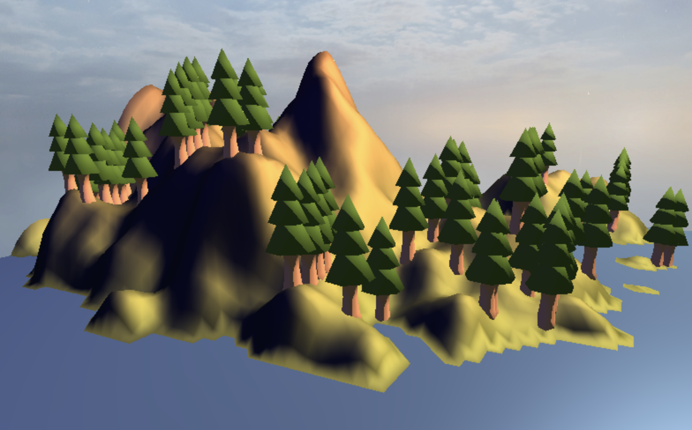
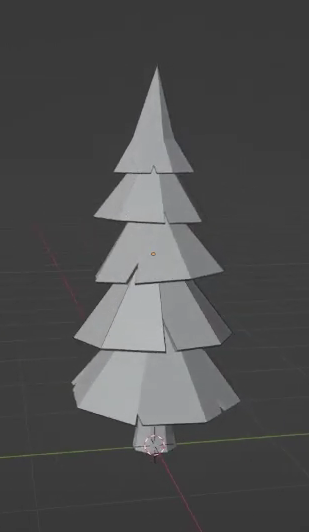
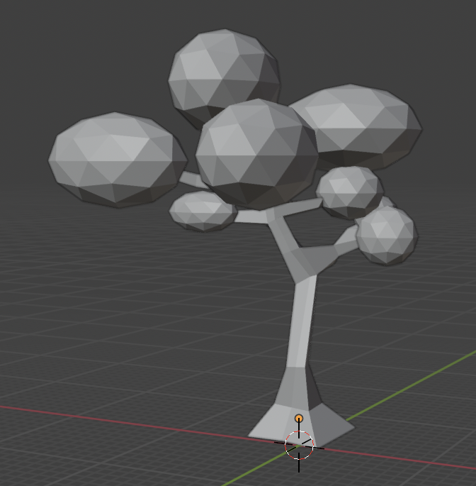
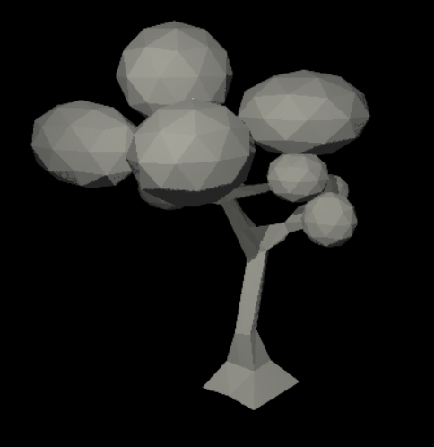
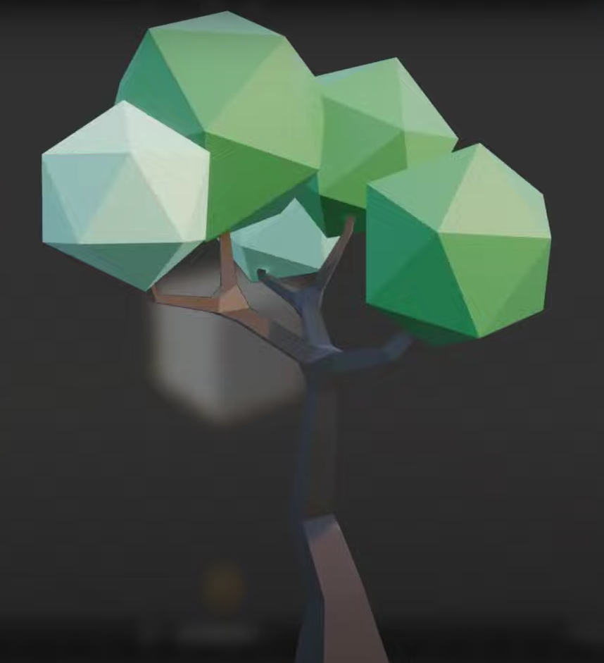
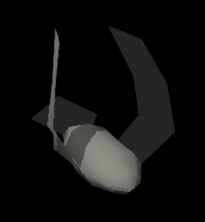
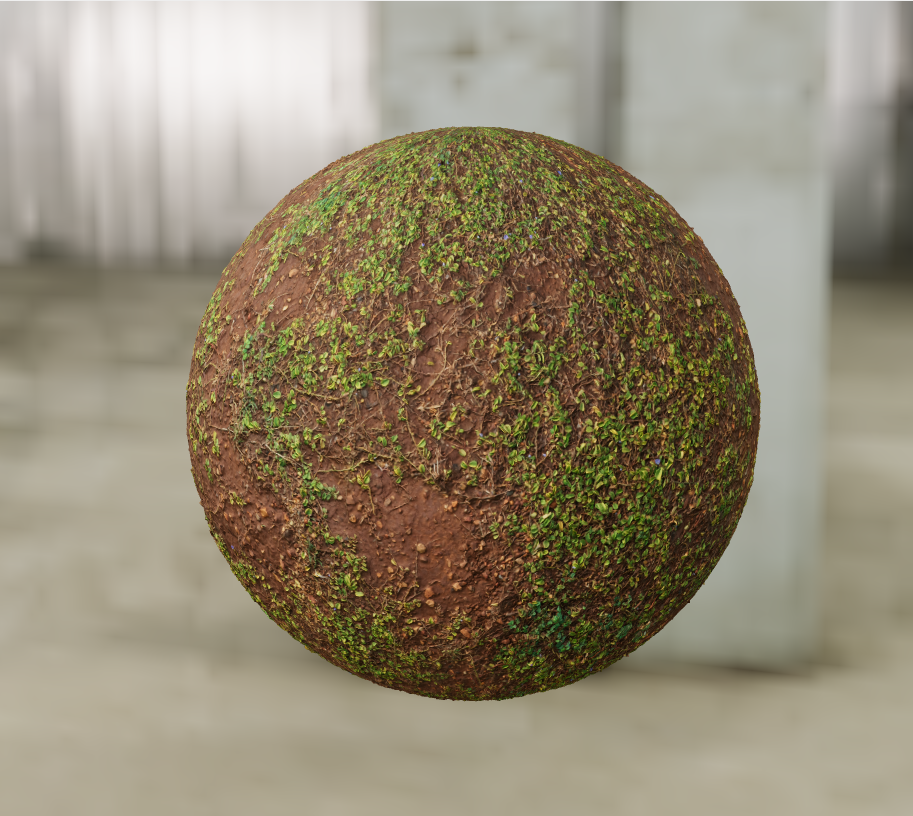
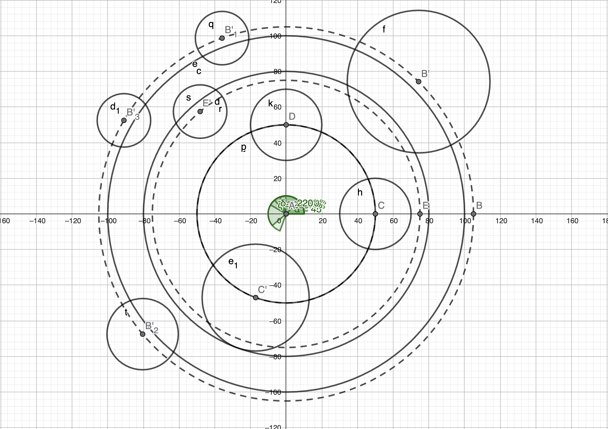

# In Flight

<video src="videos/demo_teaser.mp4" height="300px" autoplay loop></video>

<figcaption style="text-align: center;"></figcaption>

## Abstract

The goal of our project, "In Flight," is to create a dynamic and visually engaging 3D scene showcasing bird animation and flocking behavior. We aimed to implement the boids algorithm to simulate the behavior of a flock of birds flying through a forest filled with pines swirling in between them and dodging them to create a movie-like scene. 

## Overview

<video src="videos/demo_detail.mp4" height="210px" autoplay loop style="vertical-align: middle;"></video>

<figcaption style="text-align: center;">Some more visuals focusing on interesting details of your scene.</figcaption>

As described earlier in the abstract, our goal was to create a scene of birds flying through a forest in a realistic manner. To accomplish this, we first thought about implementing a boids algorithm to have better and more natural bird movement than if we had just used a linear trajectory for the birds to follow. We added the classic forces you would have in a Boids like algorithm (avoidance, cohesion, alignement and containment) while also adding some more features which will be further described in our feature validation of this effect. The second feature we decided to implement was to design our own custom meshes instead of just importing ones from the Internet. We thought this would add a more unique look to our project and we did so using Blender and tutorials on how to proceed as we had almost never used this tool. The third feature we added was Normal Mapping to have more visually complex and realistic appearance for our low-polygon models. We added this with the help of a normal map for each texture used in the scene as described in the course in more detail. The fourth feature was the implementation of fog in our scene, we thought this would give a more cinematic and mysterious look to the scene while also making it seem like a real forest which also works well with the way that the boids behave where one can see them go in and out of the fog seamlessly. The fifth and final feature were Bezier curves to have smoother camera movement and thus a nicer visual result in the end which proved to further enhance our result.

## Feature validation

<table>
	<caption>Feature Summary</caption>
	<thead>
		<tr>
			<th>Feature</th>
			<th>Adapted Points</th>
			<th>Status</th>
		</tr>
	</thead>
	<tbody>
		<tr>
			<td>Mesh and Scene Design</td>
			<td>5</td>
			<td style="background-color: #d4edda;">Completed</td>
		</tr>
		<tr>
			<td>Normal mapping</td>
			<td>10</td>
			<td style="background-color: #d4edda;">Completed</td>
		</tr>
		<tr>
			<td>Fog</td>
			<td>5</td>
			<td style="background-color: #d4edda;">Completed</td>
		</tr>
		<tr>
			<td>Boids</td>
			<td>20</td>
			<td style="background-color: #d4edda;">Completed</td>
		</tr>
		<tr>
			<td>Bezier curves</td>
			<td>10</td>
			<td style="background-color: #d4edda;">Completed</td>
		</tr>
	</tbody>
</table>

### Mesh Design

#### Implementation

We designed our meshes in Blender, mainly by following tutorials on youtube ([Pine tree tutorial](https://www.youtube.com/watch?v=mgJxH_Jc2DI), [Tree tutorial](https://www.youtube.com/watch?v=hvxoAX_poI0), [Bird tutorial](https://www.youtube.com/watch?v=eSL98LLr1kw&list=WL&index=29)). These were very helpful as it was our first/second time working with Blender and helped us achieve a good visual result while managing the object complexity.

#### Validation

<figure style="text-align: center;">
    
    <figcaption>Our pine design in Blender</figcaption>
</figure>

<figure style="text-align: center;">
    
    <figcaption>Our pine mesh rendered by the project framework</figcaption>
</figure>

<figure style="text-align: center;">
    
    <figcaption>Pine in the YouTube tutorial</figcaption>
</figure>

<figure style="text-align: center;">
    
    <figcaption>A second tree design in Blender</figcaption>
</figure>

<figure style="text-align: center;">
    
    <figcaption>Second tree design rendered by the project framework</figcaption>
</figure>

<figure style="text-align: center;">
    
    <figcaption>Tree design in the YouTube tutorial</figcaption>
</figure>

<figure style="text-align: center;">
    
    <figcaption>Our bird mesh in Blender</figcaption>
</figure>

<figure style="text-align: center;">
    
    <figcaption>Our bird design rendered by the project framework</figcaption>
</figure>

<figure style="text-align: center;">
    
    <figcaption>Bird design in the YouTube tutorial</figcaption>
</figure>

*Note: The above objects are not exhaustive of all the meshes we created.*

### Fog

#### Implementation

TODO

#### Validation

TODO

### Normal Mapping

#### Implementation

We implemented the mapping following the course's material as well as the implementation we did in the GL1 homework. For that we decided to create a new material called "NormalTexturedMaterial" which takes two parameters, which are the texture and its normal map and added a property along with it. We implemented the normal mapping directly in the blinn phong shader renderer to keep the code clean and simple. Inside the shader renderer, we used a method called "normal_data" inside cg_render_utils.js that we created for us to load the correct ressources, in order to process the normal mapping. We then loaded the necessairy ressources, by adding them to the inputs and uniforming them, to the frag and vert shaders, got the normals, tangent and bitangent vectors, for the bi-tangent vectors we used the Mesh's property "calcTangentsAndBitangents" when loading a mesh in "cg_mesh.js" (which we then normalized inside the vertex shader). We then used all the loaded ressources and computed the normal displacement to finally get the wanted result. As we will see in the validation

#### Validation

<figure style="text-align: center;">
    
    <figcaption>Texture without normal mapping</figcaption>
</figure>
<figure style="text-align: center;">
    
    <figcaption>Texture with normal mapping</figcaption>
</figure>
<figure style="text-align: center;">
    
    <figcaption>Reference texture from PolyHeaven (https://polyhaven.com/a/brown_mud_leaves_01)</figcaption>
</figure>
Here is a full representation of our normal mapping taken from internet for reference (https://en.wikipedia.org/wiki/Normal_mapping) : 

<video src="videos/Normal_map_video.mkv" height="210px" autoplay loop style="vertical-align: middle;"></video>

### Boids

#### Implementation

Our Boids algorithm simulates the flocking behavior of birds by applying a set of rules to each individual boid (bird) in the simulation. Each boid has a current position and velocity. In each step of the simulation, a new velocity is calculated for every boid based on several influencing forces, and its position is then updated. These are the forces we used :

- **The avoidanceForce** function checks for other boids within a defined avoidanceRadius. If a nearby boid is detected, a repulsive force is generated, pushing the current boid away from it. The strength of this repulsion is inversely proportional to the distance (stronger for closer boids) and is capped by avoidanceForceLimit to prevent excessively strong reactions.
  
- **The cohesionForce** function calculates the center of mass of neighboring boids within a perceptionRadius. It then generates a force vector pointing from the current boid's position towards this perceived center. The diffFromMeanPerceptionFiltered helper function is used to find this average position of neighbors.

- **The alignementForce** function calculates the average velocity of neighboring boids within the perceptionRadius. It then generates a force that attempts to steer the current boid towards this average velocity. Again, diffFromMeanPerceptionFiltered is used, this time to average the velocities of neighbors.

- **The containementForce** function uses a sophisticated system of virtual "cylinders" and boundary checks:
 - Cylinder Definitions: The cylinder helper function defines cylindrical zones in the XY plane, each with a center, radius, and a preferred direction of movement (trigonometric or inverse) for boids interacting with it.
 - Cylinder Interaction: The cylinderCheck function determines if a boid's XY position is within a cylinder. If so, it applies a force to steer the boid along the cylinder's edge in the specified direction, using a forceAngle to guide the turn.
 - Quadrant-Specific Logic: The containment logic is divided into quadrants based on the boid's angle around the Z-axis. Different sets of guiding cylinders are active in different quadrants, creating a complex, predefined flight path.
 - Global Boundaries: There's a global outer radius to prevent boids from flying too far away and an inner radius to keep them from collapsing into the origin.
 - Z-Axis Containment: Simple upper and lower limits are enforced on the Z-axis, pushing boids back towards the median flight altitude if they stray too high or too low.

- **Putting everything together :** The forces calculated from Avoidance, Cohesion, Alignment, and Containment are each multiplied by their respective weights (avoidanceWeight, cohesionWeight, alignementWeight, containementWeight). These weights determine the relative influence of each behavior which is demonstrated below in the attached videos.
The weighted forces are summed up to get a net acceleration vector.
This acceleration is then added to the boid's current velocity (scaled by the timestep dt) to compute the new velocity. The boids' speed is always clamped between the dynamicMaxSpeed which can temporarily increase the maxSpeed for boids that are lagging behind the average angular position of the flock, helping them catch up and minSpeed which doesn't ever change.

#### Validation

<figure style="text-align: center;">
  <video src="videos/boidsDemo.mp4" height="300px" autoplay loop muted></video>
  <figcaption>Illustrative video of our boids' behavior</figcaption>
</figure>

The above video showcases how our boids behave in a containment sphere isolated from all other obstacles which means the only forces they are affected by are from themselves and the containment force, this scene can be found in the file named boidsDemo_scene.js. We modified our standard boids.js file and created a new one called boidsDemo.js because we had to modify the containmentForce to work differently than in the final scene. We only included a sphere in this test scene so that the boids are isolated and their interactions are more visible than if they were flying around cylinders which explains the need for a new file. Other than that, the code in this Demo boids algorithm is the same as in our "real" scene. As we can see in the video the boids behave as expected and the below videos show what happens when adjusting the weights of certain forces so that you can better observe their effects on the boids.

<figure style="text-align: center;">
  <video src="videos/boidsDemoS.mp4" height="300px" autoplay loop muted></video>
  <figcaption>Max speed increased as well as avoidance weight</figcaption>
</figure>

In this second video we increased the max speed our boids could have by 1/3 and also multiplied the avoidance by 6 to better showcase how the forces work. As we can see, the boids' behavior seems more erratic, this is simply due to the fact that the outputted force when two birds get too close to each other is much bigger which is why some boids change directions very quickly. The speed increase is also noticeable as the boids seem to fly around much faster.

<figure style="text-align: center;">
  <video src="videos/boidsDemoC.mp4" height="300px" autoplay loop muted></video>
  <figcaption>Alignment and cohesion weight both doubled</figcaption>
</figure>

In this third video we doubled both the alignement and cohesion weights again to better showcase their effects. As can be seen, the birds now seem to split into two groups (which is the way we make them spawn) and, contrary to the other two videos, they stay in these two groups throughout the video which is simply due to the fact that the forces attracting them together is much stronger and thus overshadow the other forces affecting the boids.

We think these three videos showcase the effects well for each force on the boids and how they work all together to create a cohesive result.We decided not to include a video for each force individually as this wouldn't have been very useful and wouldn't have been a better showcase of the feature in our opinion.

### Bézier Curves

#### Implementation

TODO

#### Validation

TODO

## Discussion

### Additional Components

TODO

### Failed Experiments

One of our biggest shortcomings was our original plan on how to enforce a trajectory for the boids, which would ensure our boids circle around the origin but also have some variation with their movement (up-down, left-right). Our first step was to create 2 containment cylinders both centered at the origin and of different radiuses to have the birds fly around the origin in a circle. These were not actual cylinders but were checks on the distance of the birds. If a bird was too far from the origin (ie. "outside" of our large cylinder) we would push it back closer and conversely if a bird got too close to it. We then thought to implement a more complex trajectory in the following way : using the angle the birds formed with the Z axis to locate the bird and split our trajectory circle into 8 quadrants, we applied some effects to it (ex. a force vector of (0, 0, 1) to make the bird "fly" up or the opposite to make it go down). We thus implemented a new function called trajectoryForce (whose code can be found commented out in the boids.js file from lines 235 to 354) but the results of this proved to work in a very robotic and unnatural way, not at all what we were wishing for in the beginning. Indeed, as all the boids had the  exact same force vector applied to them at almost the same time (because 8 quadrants wasn't that big to seperate them and because we originally tested this with few boids) they all followed each other almost like if it were a carousel. The below video showcases this failed experiment and puts it into video.

<figure style="text-align: center;">
  <video src="videos/boidsDemoC.mp4" height="300px" autoplay loop muted></video>
  <figcaption>Original trajectory idea for our boids</figcaption>
</figure>

In the end we opted for another approach to fix this, and get what we wnated, which is detailed below in the Challenges section.

### Challenges

Our first big challenge to face was the implementation of a general trajectory for the boids. We thus opted for another approach which was to place "cylinders" across our scene, similar to the ones we originally used to contain the boids as our base step, as these seemed to provide the best results since the boids would dodge the obstacles in a much more natural manner. We started by multiplying our entire scene by a scale to have a "miniature" one so that we could better visualize what was going on. We also implemented a camera which filmed our scene from above the origin so that we could see the boids circling around. Using all these tools we opted to place the cylinders, which would mimick the trees, on Geogebra and thus could easily visually represent what was happening in our scene.

<figcaption style="text-align: center;">The trajectory we implemented using Geogebra</figcaption>

Using our visualization, we then were able to manually place the pine trees inside/close to the cylinders we placed to give the illusion that the birds were dodging them which created the look we were going for. This proved to be quite challenging as the process of placing the trees was quite tedious and the existing code for the birds' trajectory had to be extensively modified, mainly the containment force which was fully reworked and helper functions had to be added to better modularize the code which can all be seen in our boids.js class.

## Contributions

<table>
	<caption>Worked hours</caption>
	<thead>
		<tr>
			<th>Name</th>
			<th>Week 1</th>
			<th>Week 2</th>
			<th>Week 3</th>
			<th>Week 4</th>
			<th>Week 5</th>
			<th>Week 6</th>
			<th>Week 7</th>
			<th>Total</th>
		</tr>
	</thead>
	<tbody>
		<tr>
			<td>Ondrej</td>
			<td></td>
			<td style="background-color: #f0f0f0;"></td>
			<td></td>
			<td></td>
			<td></td>
			<td></td>
			<td></td>
			<td></td>
		</tr>
		<tr>
			<td>Marc</td>
			<td>3</td>
			<td style="background-color: #f0f0f0;"></td>
			<td>2</td>
			<td>4</td>
			<td>6</td>
			<td>6</td>
			<td>7</td>
			<td>29</td>
		</tr>
		<tr>
			<td>Clemens</td>
			<td>2</td>
			<td style="background-color: #f0f0f0;">3</td>
			<td>4</td>
			<td>5</td>
			<td>6</td>
			<td>5</td>
			<td>5</td>
			<td>30</td>
		</tr>
	</tbody>
</table>

<table>
	<caption>Individual contributions</caption>
	<thead>
		<tr>
			<th>Name</th>
			<th>Contribution</th>
		</tr>
	</thead>
	<tbody>
		<tr>
			<td>Ondrej</td>
			<td>1/3</td>
		</tr>
		<tr>
			<td>Marc</td>
			<td>1/3</td>
		</tr>
		<tr>
			<td>Clemens</td>
			<td>1/3</td>
		</tr>
	</tbody>
</table>

#### Comments

TODO

## References

[Example scene from the Lord of the Rings](youtube.com/watch?v=YH4Xr6GIp4U) from 1:22 to 1:35

[Bezier curves](https://www.shadertoy.com/view/XtBGDR)

[Boids explanation](https://en.wikipedia.org/wiki/Boids)

[Boids Algorithm](https://observablehq.com/@rreusser/gpgpu-boids)

[Normal mapping](https://lettier.github.io/3d-game-shaders-for-beginners/normal-mapping.html)

[Fog implementation](https://lettier.github.io/3d-game-shaders-for-beginners/fog.html)

[Bird design](https://www.youtube.com/watch?v=eSL98LLr1kw&list=WL&index=29)

[Pine tree](https://www.youtube.com/watch?v=mgJxH_Jc2DI)

[Low Poly](https://www.youtube.com/watch?v=hvxoAX_poI0)

[Rock blend](https://free3d.com/3d-model/low-poly-rock-4631.html)

[Free to use textures](https://polyhaven.com/)