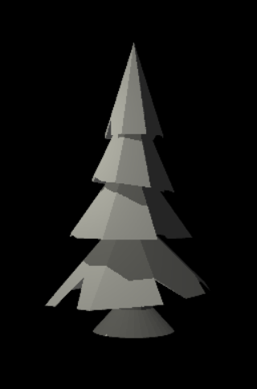
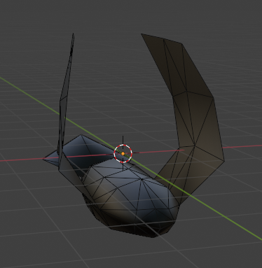
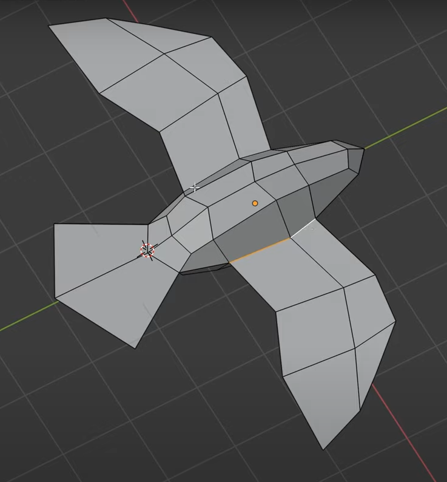

# In Flight

## Progress Summary

1. Summary of features

	<table>
		<thead>
			<tr>
				<th>Feature</th>
				<th>Adapted Points</th>
				<th>Status</th>
			</tr>
		</thead>
		<tbody>
			<tr>
				<td>Mesh Design</td>
				<td>5</td>
				<td style="background-color: #d4edda;">Completed</td> <!-- GREEN -->
			</tr>
			<tr>
				<td>Fog</td>
				<td>5</td>
				<td style="background-color: #cce5ff;">Upcoming</td> <!-- YELLOW -->
			</tr>
			<tr>
				<td>Normal Mapping</td>
				<td>10</td>
				<td style="background-color: #fff3cd;">Work in progress</td> <!-- YELLOW -->
			</tr>
			<tr>
				<tr>
					<td>Bézier Curves</td>
					<td>10</td>
					<td style="background-color: #cce5ff;">Upcoming</td> <!-- LIGHT BLUE -->
				</tr>
			</tr>
			<tr>
				<td>Boids</td>
				<td>20</td>
				<td style="background-color: #fff3cd;">Work in progress</td>
			</tr>
		</tbody>
	</table>

	<table>
		<caption>Achieved Goals</caption>
		<tr>
			<th></th>
			<th>Clemens Möbius</th>
			<th>Marc Kallergis</th>
			<th>Ondrej Zedka</th>
		</tr>
		<tr>
			<td>Week 1 (Proposal)</td>
			<td>Creating bird mesh & animating it in blender</td>
			<td>Creating tree meshes</td>
			<td>Implementing 3D boids algorithm & evolving bird position in test scene</td>
		</tr>
		<tr style="background-color: #f0f0f0;">
			<td>Week 2 (Easter)</td>
			<td>Created texture for bird mesh</td>
			<td>Creating other meshes for forest environment<s</td>
			<td>Tweaking bird animation in blender</td>
		</tr>
		<tr>
			<td>Week 3</td>
			<td>Mapping textures to meshes</td>
			<td>Adding force to control global trajectory of boids</td>
			<td>Animating birds in test scene using blender animation as support</td>
		</tr>
		<tr>
			<td>Week 4</td>
			<td>Milestone report</td>
			<td>Static scene creation</td>
			<td>Feature validation & showcases for report</td>
		</tr>
	</table>

2. Preliminary results

	{width="500px"}

	{width="500px"}

	Results and state of the project :

	We have made good progress on most of our planned tasks. We did however deviate somewhat from our plannification by prioritizing some tasks than while leaving other tasks for later. 
	For now we have :
	- A bird mesh and texture created by Clemens. This model was also animated in Blender by Clemens.
	- Multiple meshes for trees and other decorative objects created by Marc.
	- A complete working 3d model of Boid behavior implemented by Ondrej. An evolve function is in place so that actor movement can be controled by the Boid algorithm.
	- Prototypes for controlling the general direction of the flock of birds, worked on by Marc.
	- Texture applied to the bird meshes. This was done by Clemens.
	- Animated birds (flapping their wings) in the scene. This was done by Ondrej by periodicly switching the meshes of the birds in the evolve function.

3. Feature validation 
   
	- Mesh design

		- Implementation

			We designed our meshes in Blender, mainly by following tutorials on youtube ([Pine tree tutorial](https://www.youtube.com/watch?v=mgJxH_Jc2DI), [Tree tutorial](https://www.youtube.com/watch?v=hvxoAX_poI0), [Bird tutorial](https://www.youtube.com/watch?v=eSL98LLr1kw&list=WL&index=29)). These were very helpful as it was our first/second time working with Blender and helped us achieve a good visual result while managing the object complexity. 

		- Validation

			

			<figure>
				
				<figcaption>Our pine design in Blender</figcaption>
			</figure>

			<figure>
				
				<figcaption>Our pine mesh rendered by the project framework</figcaption>
			</figure>

			<figure>
				
				<figcaption>Pine in the youtube tutorial</figcaption>
			</figure>

			

			

			<figure>
				
				<figcaption>A second tree design in Blender</figcaption>
			</figure>

			<figure>
				
				<figcaption>Second tree design rendered by the project framework</figcaption>
			</figure>

			<figure>
				
				<figcaption>Tree design in the youtube tutorial</figcaption>
			</figure>

			

			

			<figure>
				
				<figcaption>Our bird mesh in Blender</figcaption>
			</figure>

			<figure>
				
				<figcaption>Our bird design rendered by the project framework</figcaption>
			</figure>

			<figure>
				
				<figcaption>Bird design in the youtube tutorial</figcaption>
			</figure>

			

		
			

			Note : The above objects are not exhaustive of all the meshes we created.
			

	

4. Number of hours each team member worked on the project.

	<table>
		<caption>Worked Hours</caption>
		<tr>
			<th></th>
			<th>Clemens Möbius</th>
			<th>Marc Kallergis</th>
			<th>Ondrej Zedka</th>
		</tr>
		<tr>
			<td>Week 1 (Proposal)</td>
			<td>2</td>
			<td>2</td>
			<td>6 </td>
		</tr>
		<tr style="background-color: #f0f0f0;">
			<td>Week 2 (Easter)</td>
			<td>3</td>
			<td>3</td>
			<td>2</td>
		</tr>
		<tr>
			<td>Week 3</td>
			<td>4</td>
			<td>4</td>
			<td>3</td>
		</tr>
		<tr>
			<td>Week 4 (in progresss)</td>
			<td>2</td>
			<td>1</td>
			<td>3</td>
		</tr>
	</table>

5. Workload and progress tracker

The pace and workload in genral match our planification. Some tasks took longer then anticipated, work in Blender for example was quite time intesive. The project is progressing well, we have found and implemented solutions for most of the key components of the final scene.

## Schedule Update

1. Delays or unexpected issues

	We currently don't have any delays or unexpected issues. We prioritized completing the Boid algorithm and Bird animation over scene design, as these two elements are crucial for our vision of the project, and we wanted to make sure they are doable and working as envisioned. Moreover in the feedback to our proposal it was mentioned that the bird animation could be very challenging.
	This means that this week and week 5 we will have less work for the bird flock integration and more work in scene creation.

2. Work plan for the remaining weeks.

	<table>
		<caption>Updated Schedule</caption>
		<tr>
			<th></th>
			<th>Clemens Möbius</th>
			<th>Marc Kallergis</th>
			<th>Ondrej Zedka</th>
		</tr>
		<tr>
			<td>Week 5</td>
			<td>Camera movement</td>
			<td>Scene texturing</td>
			<td>Bird Flock Integration</td>
		</tr>
		<tr>
			<td>Week 6</td>
			<td>Scene Polishing</td>
			<td>Scene Polishing</td>
			<td>Fog effect</td>
		</tr>
		<tr>
			<td>Week 7</td>
			<td>Feature validation & final report</td>
			<td>Feature validation & final report</td>
			<td>Feature validation & video</td>
		</tr>
	</table>