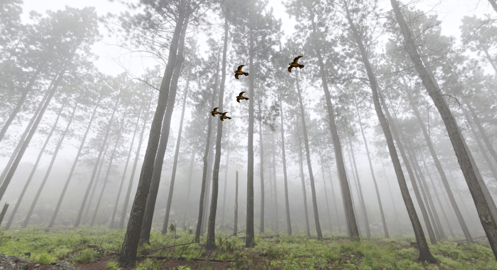
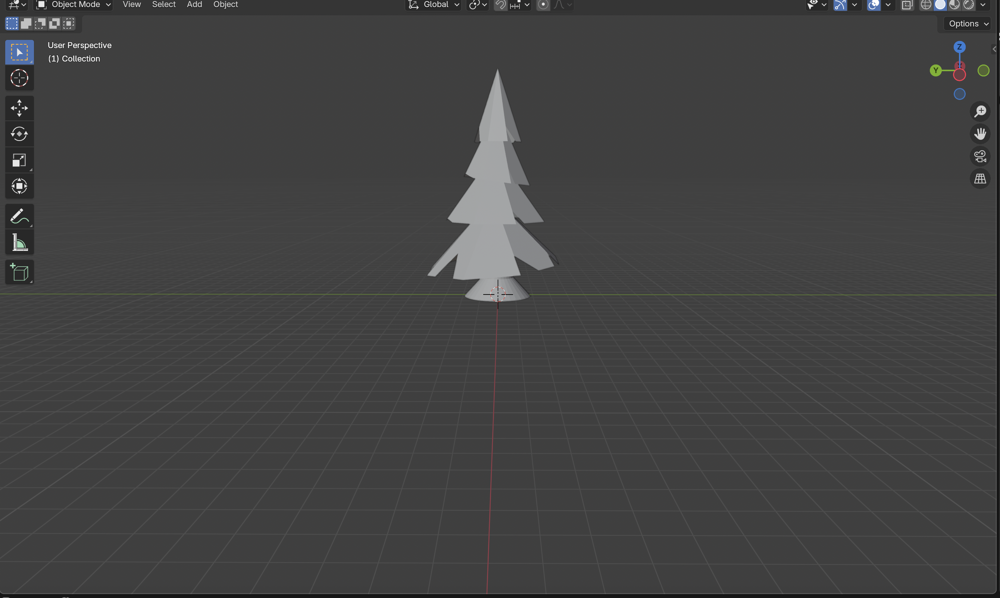
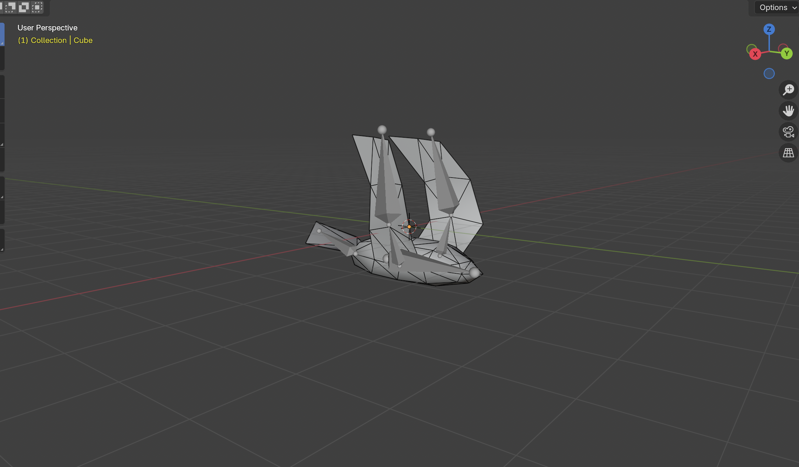

# In Flight

## Progress Summary

1. Summarize what you have accomplished so far.

	<table>
		<thead>
			<tr>
				<th>Feature</th>
				<th>Adapted Points</th>
				<th>Status</th>
			</tr>
		</thead>
		<tbody>
			<tr>
				<td>Mesh Design</td>
				<td>5</td>
				<td style="background-color: #d4edda;">Completed</td> <!-- GREEN -->
			</tr>
			<tr>
				<td>Fog</td>
				<td>5</td>
				<td style="background-color: #cce5ff;">Upcoming</td> <!-- YELLOW -->
			</tr>
			<tr>
				<td>Normal Mapping</td>
				<td>10</td>
				<td style="background-color: #fff3cd;">Work in progress</td> <!-- YELLOW -->
			</tr>
			<tr>
				<tr>
					<td>Bézier Curves</td>
					<td>10</td>
					<td style="background-color: #cce5ff;">Upcoming</td> <!-- LIGHT BLUE -->
				</tr>
			</tr>
			<tr>
				<td>Boids</td>
				<td>20</td>
				<td style="background-color: #fff3cd;">Work in progress</td>
			</tr>
		</tbody>
	</table>

	<table>
		<caption>Achieved Goals</caption>
		<tr>
			<th></th>
			<th>Clemens Möbius</th>
			<th>Marc Kallergis</th>
			<th>Ondrej Zedka</th>
		</tr>
		<tr>
			<td>Week 1 (Proposal)</td>
			<td>Creating bird mesh & animating it in blender</td>
			<td>Creating tree meshes</td>
			<td>Implementing 3D boids algorithm & evolving bird position in test scene</td>
		</tr>
		<tr style="background-color: #f0f0f0;">
			<td>Week 2 (Easter)</td>
			<td>Created texture for bird mesh</td>
			<td>Created more tree meshes as well as misc objects</td>
			<td> ?? Regarder push git</td>
		</tr>
		<tr>
			<td>Week 3</td>
			<td>Mapping textures to meshes</td>
			<td>Adding force to control global trajectory of boids</td>
			<td>Animating birds in test scene using blender animation as support</td>
		</tr>
		<tr>
			<td>Week 4</td>
			<td>Milestone report</td>
			<td>Static scene creation</td>
			<td>Feature validation & showcases for report</td>
		</tr>
	</table>

2. Show some preliminary results.

	{width="300px"}

	{width="500px"}

	Results and state of the project :

	We have made good progress on most of our planned tasks. We did however deviate somewhat from our plannification by prioritizing some tasks than while leaving other tasks for later. 
	For now we have :
	- A bird mesh and texture created by Clemens. This model was also animated in Blender by Clemens.
	- Multiple meshes for trees and other decorative objects created by Marc.
	- A complete working 3d model of Boid behavior implemented by Ondrej. An evolve function is in place so that actor movement can be controled by the Boid algorithm.
	- Prototypes for controlling the general direction of the flock of birds, worked on by Marc.
	- Texture applied to the bird meshes. This was done by Clemens.
	- Animated birds (flapping their wings) in the scene. This was done by Ondrej by periodicly switching the meshes of the birds in the evolve function.

3. Already validated features 
   
	- Mesh design

		- Implementation

			We implemented the design of our meshes mainly by following tutorials on youtube which very helpful and provided better results than what we could have achieved on our own as it was our first/second time working with Blender.

		- Validation

			{width="500px"}

			{width="500px"} 
			
			{width="500px"}

			Note : The above objects are not exhaustive of all the meshes we created.
			

	

4. Number of hours each team member worked on the project.

	<table>
		<caption>Worked Hours</caption>
		<tr>
			<th></th>
			<th>Clemens Möbius</th>
			<th>Marc Kallergis</th>
			<th>Ondrej Zedka</th>
		</tr>
		<tr>
			<td>Week 1 (Proposal)</td>
			<td>2</td>
			<td>?</td>
			<td>6 </td>
		</tr>
		<tr style="background-color: #f0f0f0;">
			<td>Week 2 (Easter)</td>
			<td>3</td>
			<td>3?</td>
			<td>2</td>
		</tr>
		<tr>
			<td>Week 3</td>
			<td>4</td>
			<td>?</td>
			<td>3</td>
		</tr>
		<tr>
			<td>Week 4 (in progresss)</td>
			<td>2</td>
			<td>?</td>
			<td>1</td>
		</tr>
	</table>

5. Workload and progress tracker

We are well coordinated on the workload that we intended to do and it suits our pace well. The work on week 1 (and easter) was a bit harder since we all had to do the tutorial as well as doing what was intended for the project's first week, Marc and Clemens had to get familiar with Blender (altough they did the tutorial on week 1) but since it was easter break they had plenty of time, they were able to finish it in time. Ondrej's workload was a bit high too but as said before, there was enough time to catch up during the break. We are doing pretty well at keeping track of what we have to do and how.

## Schedule Update

1. Delays or unexpected issues

	We currently don't have any delays or unexpected issues. We prioritized completing the Boid algorithm and Bird animation over scene design, as these two elements are crucial for our vision of the project, and we wanted to make sure they are doable and working as envisioned. Moreover in the feedback to our proposal it was mentioned that the bird animation could be very challenging.
	This means that this week and week 5 we will have less work for the bird flock integration and more work in scene creation.

2. Work plan for the remaining weeks.

	<table>
		<caption>Updated Schedule</caption>
		<tr>
			<th></th>
			<th>Clemens Möbius</th>
			<th>Marc Kallergis</th>
			<th>Ondrej Zedka</th>
		</tr>
		<tr>
			<td>Week 5</td>
			<td>Camera movement</td>
			<td>Scene texturing</td>
			<td>Bird Flock Integration</td>
		</tr>
		<tr>
			<td>Week 6</td>
			<td>Scene Polishing</td>
			<td>Scene Polishing</td>
			<td>Fog effect</td>
		</tr>
		<tr>
			<td>Week 7</td>
			<td>Feature validation & final report</td>
			<td>Feature validation & final report</td>
			<td>Feature validation & video</td>
		</tr>
	</table>