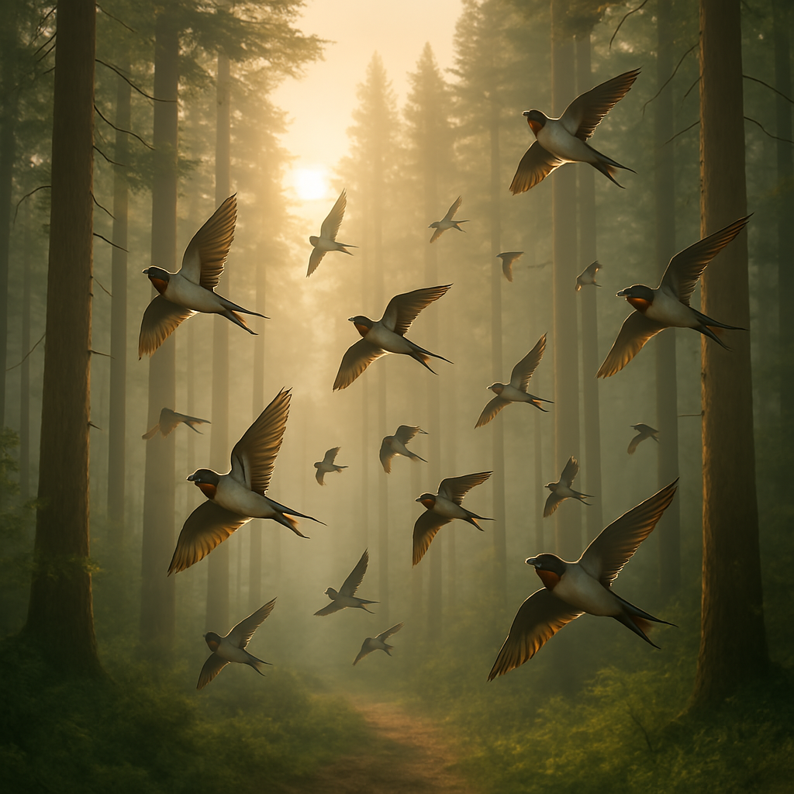

# In Flight

{width="300px"}

## Abstract

We want to model a flock of birds, flying through a forest scene with a camera following the movement of the flock. The goal, inspired by movie scenes (see the example provided in ressources), is to create a cinematic and visually pleasing representation of these birds flying in a synchronized manner around obstacles. We want to model the flock of birds using the Boids algorithm. This will require a 3D implementation of the algorithm and some adjustments in order to control the general flight path of the birds. The camera will follow the birds in a fluid way to add dynamicity to the scene. To achieve this effect we will use Bezier curves for the camera path. We intend to make our own meshes for the birds and trees in the scene and will model them using Blender. We expect the bird models to be challenging as we would like to animate them in flight for more realism. We think we could do that either by exporting keyframes from blender and switching between the models or by constructing the birds from multiple meshes that could be moved separately. Finally, we wish to implement normal mapping to add detail to the models such that our scene has a more realistic feel as well as a fog effect helping with ambience and immersion by obscurring the edges of out scene.

## Features

| Feature          | Points | Adapted Points |
|------------------|--------|----------------|
| Mesh design      | 5      | 5              |
| Fog              | 5      | 5              |
| Normal mapping   | 10     | 10             |
| Bézier Curves    | 10     | 10             |
| Boids            | 20     | 20             |

## Schedule

<table>
	<tr>
		<th style="width: 20%"></th>
		<th>Name 1</th>
		<th>Name 2</th>
		<th>Name 3</th>
	</tr>
	<tr>
		<td>Week 1</td>
		<td></td>
		<td></td>
		<td></td>
	</tr>
	<tr style="background-color: #f9f9f9;">
		<td colspan="4" align="center">Proposal</td>
	</tr>
	<tr>
		<td>Week 2 (Easter)</td>
		<td></td>
		<td></td>
		<td></td>
	</tr>
	<tr>
		<td>Week 3</td>
		<td></td>
		<td></td>
		<td></td>
	</tr>
	<tr>
		<td>Week 4</td>
		<td></td>
		<td></td>
		<td></td>
	</tr>
	<tr style="background-color: #f9f9f9;">
		<td colspan="4" align="center">Milestone</td>
	</tr>
	<tr>
		<td>Week 5</td>
		<td></td>
		<td></td>
		<td></td>
	</tr>
	<tr>
		<td>Week 6</td>
		<td></td>
		<td></td>
		<td></td>
	</tr>
	<tr>
		<td>Week 7</td>
		<td></td>
		<td></td>
		<td></td>
	</tr>
	<tr style="background-color: #f9f9f9;">
		<td colspan="4" align="center">Video and Report</td>
	</tr>
</table>

## Resources

Example scene from the Lord of the Rings : <youtube.com/watch?v=YH4Xr6GIp4U> from 1:22 to 1:35
Bezier curves : <https://www.shadertoy.com/view/XtBGDR>
Boids explanation : <https://en.wikipedia.org/wiki/Boids>
Boids Algorithm : <https://observablehq.com/@rreusser/gpgpu-boids>
Normal mapping : <https://lettier.github.io/3d-game-shaders-for-beginners/normal-mapping.html>
Fog implementation: <https://lettier.github.io/3d-game-shaders-for-beginners/fog.html>
Bird design : <https://www.youtube.com/watch?v=eSL98LLr1kw&list=WL&index=29>

